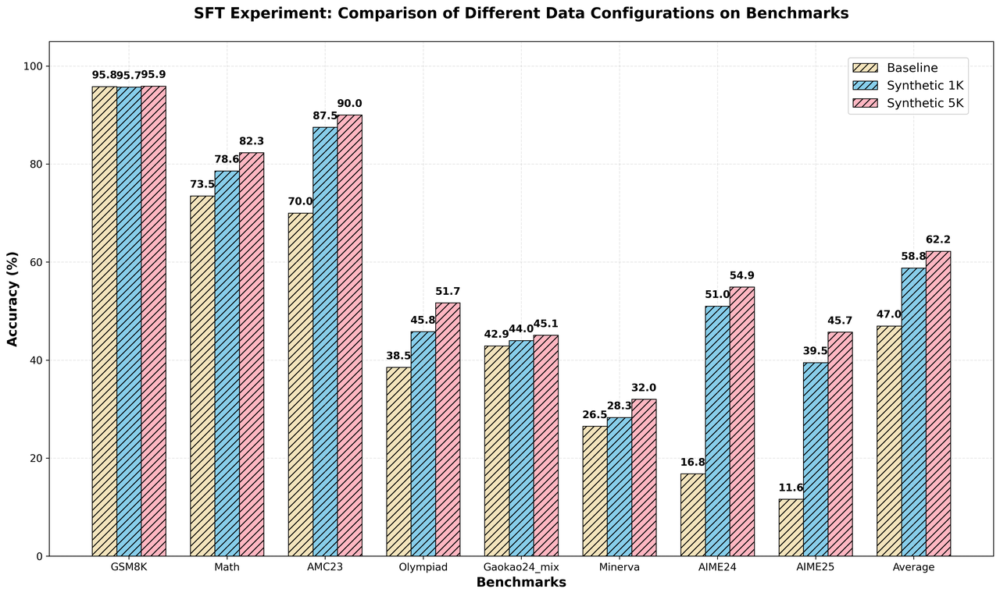

# DataFlow

<div align="center">
  


[](https://github.com/Open-DataFlow/DataFlow/blob/main/LICENSE)
[](https://github.com/Open-DataFlow/DataFlow)
[](https://github.com/Open-DataFlow/DataFlow/issues)
[](https://github.com/Open-DataFlow/DataFlow/commits/main/)
[](https://github.com/Open-DataFlow/DataFlow/graphs/contributors)

[简体中文](./README.zh-CN.md) | English


**[Features](#Features) • [Quick Start](#Quick_Start) • [Documentation](https://open-dataflow.github.io/DataFlow-Doc/) • [Contributing](#贡献) • [License](#许可证)**


</div>


## News
- [2025-07-25] 🎉 We release the dataflow-agent.
- [2025-06-30] 🎉 We release the documentation of dataflow.
<!-- - [2025-05-30] 🎉 We added two data processing pipelines, i.e. knowledge base cleaning, and agentic rag data construction pipeline. -->
<!-- - [2025-04-30] 🎉 We added four data processing pipelines, i.e. text, code, nl2sql, and reasoning data pipeline. -->
<!-- - [2024-12-26] 🎉 Our first data evaluation and processing system is now open source. -->
- [2024-10-14] 🎉 We summarize data evaluation papers and codes in [👋 Awesome Data Evaluation](./Awesome_Data_Evaluation.md)
- [2024-10-14] 🎉 Our first data-centric evaluation system is now open source.
- 
## Overview
DataFlow is a data evaluation and processing system designed to:
1. Evaluate data quality from multiple dimensions; 
2. Filter out high-quality data and 
3. Generate chain-of-thought or other types of augmentation. We mainly support SOTA algorithms within academic papers with strong theoretical support.

<!-- We now support text, image, video, and multimodality data types. -->
Specifically, we first build various `operators` based on rules, LLMs, and LLM APIs, which are then assembled into six `pipelines`. These pipelines form the complete `Dataflow` system. Further, We also build an `agent` that can flexibly compose new pipelines with existing `operators` on demand.


## Pipelines
Current Pipelines in Dataflow are as follows:
- **Reasoning Pipeline**: Enhances existing question–answer pairs with (1) extended chain-of-thought, (2) category classification, and (3) difficulty estimation.
- **Text2SQL Pipeline**: Translates natural language questions into SQL queries, supplemented with explanations, chain-of-thought reasoning, and contextual schema information.


## Installation
For environment setup, please using the following commands👇

```shell
conda create -n dataflow python=3.10
conda activate dataflow
pip install -e .
```

## Features
### 1. Reasoning Pipeline


For demo inputs and outputs, you can refence our [Reasoning Pipeline sample](https://huggingface.co/datasets/Open-Dataflow/dataflow-demo-Reasonning/) on Huggingface.

- Performance Boost：
  - 


### 2. Text2SQL 
